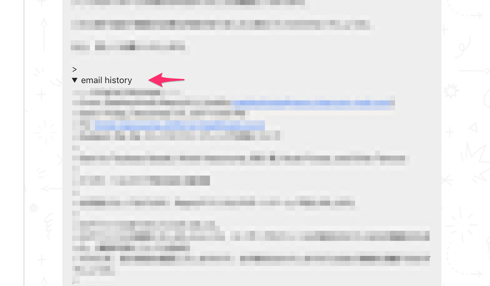
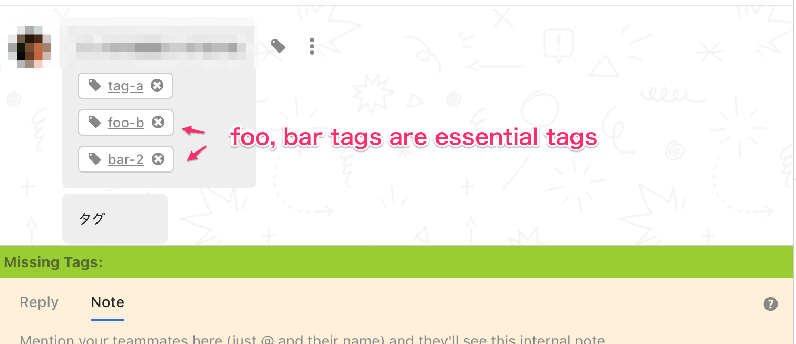
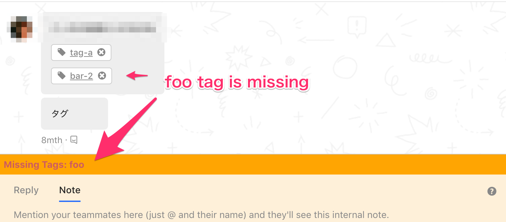
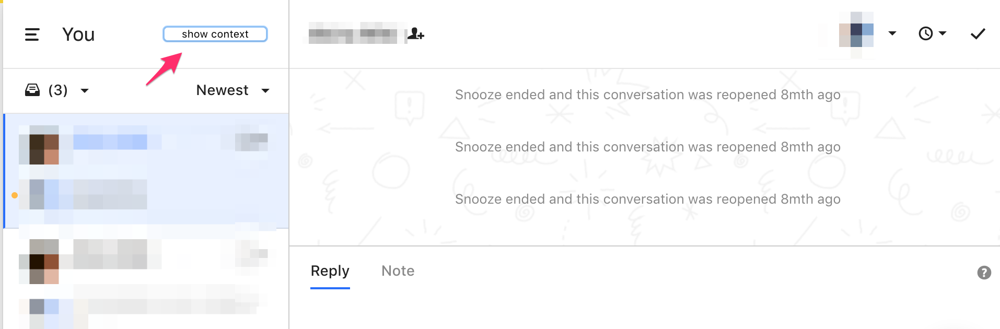

# refine-intercom

## Features

### Automatically ellipsis email history



### Check essential tag exists on conversation




### Expand conversation window button



### missing conversation tag checker


## Getting Started

Must Read https://developer.chrome.com/extensions/getstarted

```
git clone git@github.com:threetreeslight/refined-intercom.git
```

